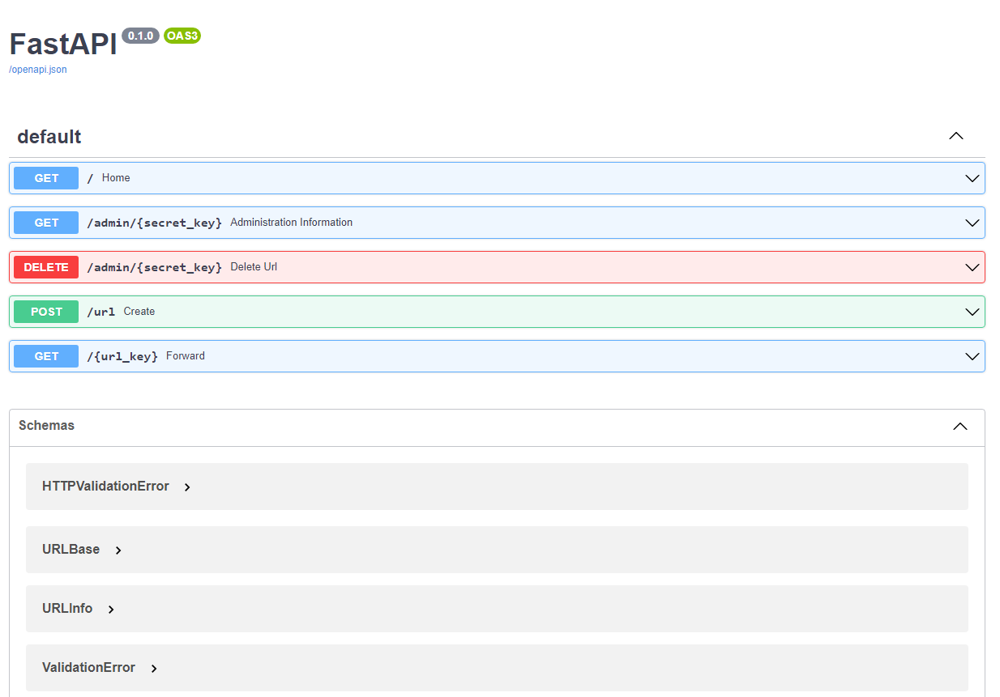

# fastapi-url-shortener
 An example URL shortener using FastAPI




# Docker
```
docker pull nekosantk/fastapi-url-shortener:latest
docker run nekosantk/fastapi-url-shortener:latest
```

# Installation
1. Install the back-end requirements in the environment of your choice:
```
$ cd /path/to/repo/
$ python3 -m pip install -r requirements.txt
```
2. Create a file called .env in the root of the project and add a secure secret key:
```
ENV_NAME="local"
BASE_URL="http://127.0.0.1:8000"
DB_URL="sqlite:///./shortener.db"
```
3. Run the FastAPI project (by default on port 8000):
```
uvicorn fastapi-url-shortener.main:app --host 0.0.0.0 --reload
```